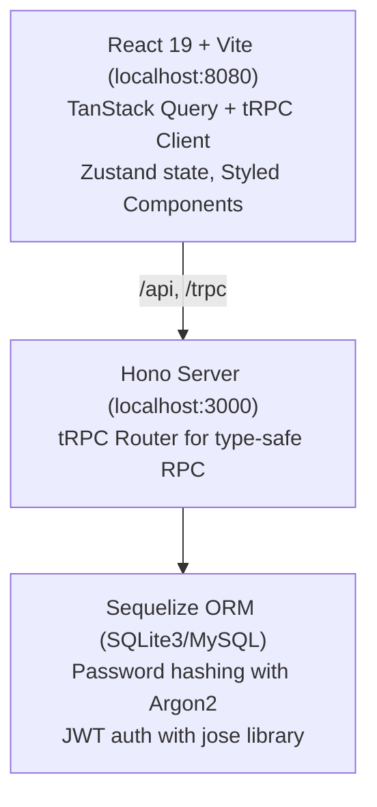

# CLAUDE.md

This file provides guidance to Claude Code (claude.ai/code) when working with code in this repository.

## Project Overview

Full-stack TypeScript web template with React 19 + Vite frontend and Hono + tRPC backend. Uses Sequelize ORM with SQLite3/MySQL, Zustand for client state, and React Email with SendGrid for email.

## Commands

```bash
npm start                 # Runs client (8080) + server (3000) + email preview (9999) concurrently
npm run check             # TypeScript type checking (tsc --noEmit)
npm run format            # Prettier formatting
npm test                  # Run test suite
npm run build             # Production build (client + server)
npm run start:client      # Vite dev server only
npm run start:server      # Backend with tsx --watch
npm run start:emails      # Email preview server
```

## Architecture



## Source Structure

- `src/client/` - React frontend (components, pages, services, state, router)
- `src/server/` - Hono backend (actions, models, services, router)
- `src/config/` - Environment config with Zod validation
- `src/emails/` - React Email templates

## File Structure Patterns

### Naming Conventions

- **Directories and files**: kebab-case (e.g., `forgot-password/`, `forgot-password.tsx`)
- **Import extensions**: Use `.js` extensions in import paths (NodeNext module resolution)
- **Path aliases**: `client/*`, `server/*`, `config/*`, `emails/*` map to `src/` subdirs

### Client

- **Pages**: Each page lives in `src/client/pages/{name}/` with `{name}.tsx` and `{name}.style.ts`. Styles imported as namespace (`import * as Style from "client/pages/{name}/{name}.style.js"`).
- **Components**: Each component lives in `src/client/components/{name}/` with `{name}.tsx`. Add a `.style.ts` when styling is needed.
- **State**: Zustand stores in `src/client/state/`, named exports using `create()`.

### Server

- **Actions**: Each action in `src/server/actions/{name}.ts`, exported as named export using `publicProcedure`, aggregated in router via dynamic imports with spread.
- **Models**: Each model in `src/server/models/{name}.ts`, default export extending Sequelize `Model`, auto-loaded by database service.
- **Services**: Singleton services in `src/server/services/`, default exports.

### Shared

- **Config**: Single `src/config/index.ts` with Zod-validated env vars.
- **Emails**: React Email templates in `src/emails/`, default exports, typed props.
- **tRPC mutations** accept FormData and validate with Zod schemas.

## Completion Rules

Before considering any task complete, the following must pass:

- `npm run check` — TypeScript type checking
- `npm test` — test suite
- `npm run format` — code formatting

## Environment

Uses dotenvx for encrypted environment variables. Copy `.env.example` to `.env.local` for development. Required variables defined in `src/config/index.ts`.
